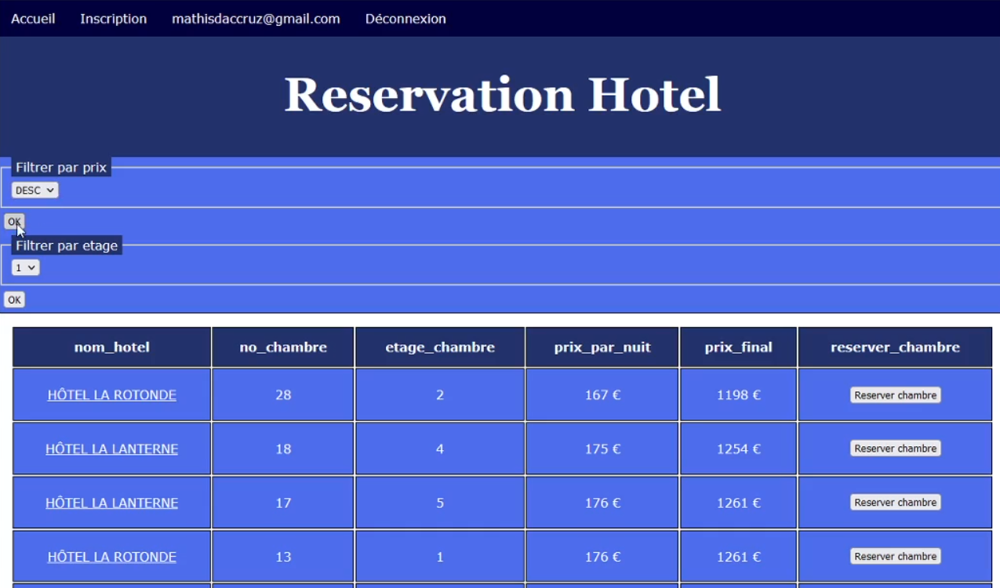
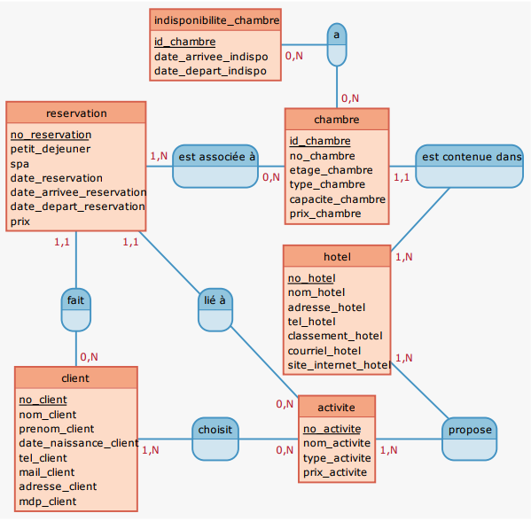

# Hotel Reservations

The project involves creating a system for reserving and canceling rooms in multiple hotels through a web client.  
This includes user account registration and login.  
The project utilizes a database server using the relational database management system PostgreSQL.  
There is also a web server with PHP connecting to the database server.  
The system allows for displaying and filtering search results based on user-selected criteria.  
Licence 3 project made for the Database cursus at CY Paris Université.  
Made with Pasbeau Arthur and Zitouni Melissa.

Here, a webpage from the web application to book hotels :  

An example of the tables relations inside the database :  

